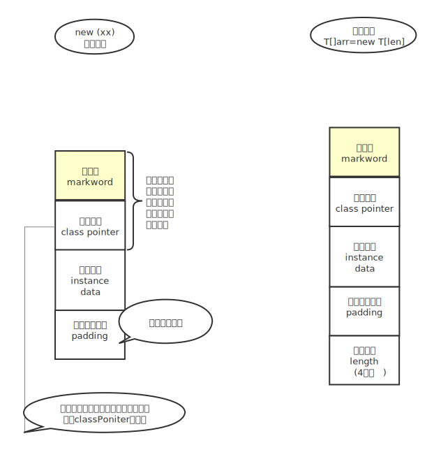
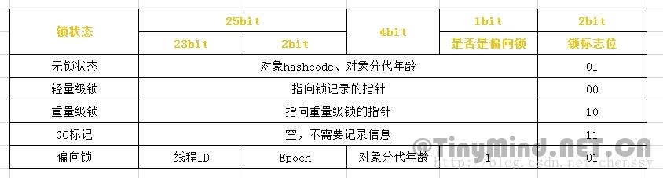

## 1. CAS实现的乐观锁

CAS（Compare And Swap 比较并且替换）是乐观锁的一种实现方式，是一种轻量级锁，JUC 中很多工具类的实现就是基于 CAS 的，也可以理解为自旋锁

JUC是指`import java.util.concurrent`下面的包，

比如：`import java.util.concurrent.atomic.AtomicInteger;`

最终实现是汇编指令：`lock cmpxchg` 不仅仅是CAS的底层实现而且它是`volatile 、synchronized` 的底层实现

### 1.1CAS如何实现线程安全？

线程在读取数据时不进行加锁，在准备写回数据时，先去查询原值，操作的时候比较原值是否修改，若未被其他线程修改则写回，若已被修改，则重新执行读取流程

举个栗子：现在一个线程要修改数据库的name，修改前我会先去数据库查name的值，发现name=“**A**”，拿到值了，我们准备修改成name=“**b**”，在修改之前我们判断一下，原来的name是不是等于“**A**”，如果被其他线程修改就会发现name不等于“**A**”，我们就不进行操作，如果原来的值还是A，我们就把name修改为“**b**”，至此，一个流程就结束了。

### 1.2 CAS会带来什么问题？

1. 如果一致循环,CPU开销过大

是因为CAS操作长时间不成功的话，会导致一直自旋，相当于死循环了，CPU的压力会很大。

1. ABA问题

#### 1.2.1 什么是ABA问题？

1. 线程1读取了数据A
2. 线程2读取了数据A
3. 线程2通过CAS比较，发现值是A没错，可以把数据A改成数据B
4. 线程3读取了数据B
5. 线程3通过CAS比较，发现数据是B没错，可以把数据B改成了数据A
6. 线程1通过CAS比较，发现数据还是A没变，就写成了自己要改的值FF

在这个过程中任何线程都没做错什么，但是值被改变了，线程1却没有办法发现，其实这样的情况出现对结果本身是没有什么影响的，但是我们还是要防范，怎么防范我下面会提到。

### 1.3 JUC举例分析CAS

AtomicInteger的自增函数incrementAndGet（）

其实是调用Unsafe类的getAndAddInt

```
    public final int incrementAndGet() {
        return U.getAndAddInt(this, VALUE, 1) + 1;
    }


public final int getAndAddInt(Object o, long offset, int delta) {
        int v;
        do {
            v = this.getIntVolatile(o, offset);
        } while(!this.weakCompareAndSetInt(o, offset, v, v + delta));

        return v;
    }
```

大概意思就是循环判断给定偏移量是否等于内存中的偏移量，直到成功才退出，看到do while的循环没。

### 1.4 实际应用保证CAS产生的ABA安全问题？

**加标志位**，例如搞个自增的字段version，操作一次就自增加一，或者version字段设置为时间戳，比较时间戳的值

举个栗子：现在我们去要求操作数据库，根据CAS的原则我们本来只需要查询原本的值就好了，现在我们一同查出他的标志位版本字段vision。

```sql
update table set value = newValue where value = #{oldValue}
//oldValue就是我们执行前查询出来的值
update table set value = newValue ，vision = vision + 1 where value = #{oldValue} and vision = #{vision} 
// 判断原来的值和版本号是否匹配，中间有别的线程修改，值可能相等，但是版本号100%不一样
```

## 2. 悲观锁

### 2.1JVM 悲观锁synchronized

[关于synchronized到底锁住的是什么？](<https://blog.csdn.net/qq_39455116/article/details/86634362>)

```sql
https://blog.csdn.net/qq_39455116/article/details/86634362
```

在上面的博客中，我们可以看到：

1. 第一种：synchronized可以让线程A进入，A结束之后,B线程才能进入

2. 第二种：也可以让线程ABC在不同的时刻进入，只要不是同时就行

而且即使是第一种，当前方法A也不会对当前类里面的其他的方法有影响，并不是说会把当前类的所有方法都锁住，只是锁一个方法而已

### 2.2 Synchronized 之Monitor对象

#### synchronized原理：

monitor对象




#### 2.2.1 JDK8markword实现表




**无锁-偏向锁-轻量级锁（自旋锁、自适应自旋锁）-重量级锁**

#### 2.2.2如何查看Java字节码：

1. 找到【**Plugins**】选项，可以首先确认一下是否安装ByteCode Viewer插件，如果没有安装，可以按照下图示意来进行搜索安装或者安装：**jclasslib byteCode viewer**

2. 点击菜单栏【**View**】,弹出下拉选项，在选项中找到【**Show Bytecode**】按钮，单击此按钮，来查看java类字节码。

#### 2.2.3 加synchronized之后对象到底哪里变化了？

请运行下面的代码，注意添加Maven

```java
<dependency>
<groupId>org.openjdk.jol</groupId>
<artifactId>jol-core</artifactId>
<version>0.9</version>
</dependency>
```


```java
public class CasOptimistic {
    /**
     * 查看普通数组的构成
     */
    public static void getSimpleArr() {
        int arr[] = new int[]{};
        String arrStr = ClassLayout.parseInstance(arr).toPrintable();
        System.out.println(arrStr);
        System.out.println("----------------------");
    }

    /**
     * 查看普通对象的构成
     */
    public static void getSimple() {
        Object o = new Object();
        String str = ClassLayout.parseInstance(o).toPrintable();
        System.out.println(str);
        System.out.println("----------------------");
    }


    /**
     * 查看普通对象加上锁之后的构成，发现只有头文件变了，说明sync只与对象头文件相关
     */
    public static void getSyncSimple() {
        Object o = new Object();
        synchronized (o){
            String str = ClassLayout.parseInstance(o).toPrintable();
            System.out.println(str);
        }
        System.out.println("----------------------");
    }

    public static void main(String[] args) {
        getSimpleArr();
        getSimple();
        getSyncSimple();
    }
}
```

只要你打印下面程序的结果就会发现了，只有对象头markword变化了

```
0     4        (object header)                           05 00 00 00 (00000101 00000000 00000000 00000000) (5)
4     4        (object header)                           00 00 00 00 (00000000 00000000 00000000 00000000) (0)
      加上锁之后变成了
0     4        (object header)                           05 78 e5 e8 (00000101 01111000 11100101 11101000) (-387614715)
4     4        (object header)                           47 02 00 00 (01000111 00000010 00000000 00000000) (583)
```

#### 2.2.4 synchronized锁升级过程

所以synchronized 锁优化的过程和markword息息相关

markword中最低三位代表锁状态，第一位代表是否是偏向锁，2、3位代表锁标志位

**无锁**：对象头里面存储当前对象的hashcode，即原来的Markword组成是：001+hashcode

**偏向锁**：其实就是偏向一个用户，适用场景，只有几个线程，其中某个线程会经常访问，他就会往对象头里面添加线程id，就像在门上贴个纸条一样，占用当前线程，只要纸条存在，就可以一直用

**轻量级锁**：比如你贴个纸条，一直使用，但是其他人不乐意了，要和你抢，只要发生抢占，synchronized就会升级变成轻量级锁，也就是不同的线程通过CAS方式抢占当前对象的指针，如果抢占成功，则把刚才的线程id改成自己栈中锁记录的指针LR（LockRecord），因为是通过CAS的方式，所以也叫自旋锁

这个时候你可能回想，无论变成什么锁，对象头都会发生改变，那之前对象头里面存储的hashcode会不会丢失啊？

答案：不会，在发生锁的第一刻，他就会把原来的header存储在自己的线程栈中，所以不会丢失

**什么时候重量级锁？**

线程非常多，比如有的线程超过10次自旋，-XX:PreBlockSpin，或者自旋次数超过CPU核数的一半，就会升级成重量级锁，当然Java1.6之后加入了**自适应自旋锁**，JVM自己控制自旋次数

而且重量级锁是操作系统实现的

#### 2.2.5 synchronized最底层实现

还是CAS

#### 2.2.6 锁降级

要求比较严格，而且只有偏向锁回到无锁的过程，其它的没有，而且是要很长时间线程确认死了的情况下才会有

#### 2.2.7 锁粗化

```java
    /**
     * 锁粗化 lock coarsening
     *
     * @param str
     * @return
     */
    public String test(String str) {
        int i = 0;
        StringBuffer sb = new StringBuffer();
        while (i < 100) {
            sb.append(str);
            i++;
        }
        return sb.toString();
    }
```

因为stringbuffer的append()是synchronized的，但循环里面如果每次都加锁，就会加锁、释放锁一百次，所以JVM就会将加上锁的访问粗化到这一连串的操作，比如while循环，只要加一次锁即可


#### 2.2.8 锁消除

```java
/**
* 锁消除 lock eliminate
*
* @param str1
* @param str2
*/
public void add(String str1, String str2) {
StringBuffer sb = new StringBuffer();
sb.append(str1).append(str2);
}
```

因为stringBuffer里面都是synchronied，所以里面的append就会消除锁


